# V-DESK Workspace & Consulting LLP
## Comprehensive Website Architecture & Technical Blueprint (Version 1.0)
**Project Code:** VDESK-WEB-V1  
**Target Platform:** WordPress + Elementor Pro (or Modern Headless / Static Export)  
**Primary References Analyzed:** TeamCo.Work, VirtualXcel  
**Document Author:** Antigravity Principal Solutions Architect  
**Status:** Approved & Ready for Freelance / Agency Development  

---

## 1. Executive Summary & Project Objectives

**V-DESK Workspace & Consulting LLP** is positioned as **India’s Trusted Virtual Office & Business Solutions Partner**. Unlike legacy virtual office brokers who simply resell addresses, V-DESK provides an end-to-end legal, tax-compliant, and operational infrastructure for modern enterprises.

### Core Strategic Objectives
1. **High-Intent Lead Generation:** Maximize inbound qualified inquiries for high-margin services (Virtual Office for GST, APOB/VPOB registrations, Company Incorporation, and Coworking/Private Cabins).
2. **Organic SEO Dominance:** Build programmatic city-specific landing pages and tax/compliance resource hubs that rank for high-intent keywords across Delhi NCR, Bangalore, Mumbai, Hyderabad, Pune, Chennai, etc.
3. **Conversion Rate Optimization (CRO):** Reduce customer friction via standout interactive tools (Business Setup Wizard, Live Seat Availability Explorer, Office Cost Calculator, Plan Comparison Table, and 1-click WhatsApp routing).
4. **Authority & Brand Positioning:** Present V-DESK as a legitimate corporate legal and infrastructure partner with verified physical presence, genuine electricity bill proof, and dedicated CA support.

---

## 2. Target Audience Personas

| Persona | Core Pain Point | V-DESK Value Hook | Primary Conversion Asset |
| :--- | :--- | :--- | :--- |
| **Tech Startups & Founders** | High burn rate on physical office leases; needs MCA registration fast. | Same-day agreement issuance, prestigious prime address, 88% cost savings. | Cost Calculator & Setup Wizard |
| **E-Commerce Sellers (Amazon/Flipkart)** | Needs multi-state GST registration (VPOB/APOB) across various state fulfilment hubs. | 100% GST approval guarantee, utility bills, physical signage verification. | GST City Pages & Quick Quote |
| **Chartered Accountants & Legal Advisors** | Needs reliable partner to park client registrations with zero inspection surprises. | Dedicated CA partner desk, wholesale bulk pricing, landlord cooperation. | CA Partnership Hotline & Checklist |
| **SMEs Expanding to New Cities** | Setting up local branch office presence without hiring administrative staff. | Prime address, receptionist mail handling, on-demand meeting rooms. | Plan Comparison Matrix |
| **Freelancers & Remote Teams** | Isolation, unprofessional residential address for client invoicing. | Coworking flex desks, 4-Pax huddle rooms, professional business identity. | Live Seat Availability Explorer |

---

## 3. Information Architecture & URL Hierarchy

```mermaid
graph TD
  Home["/ (Home Page)"]
  VO["/virtual-office/"]
  Cities["/locations/"]
  CW["/coworking-spaces/"]
  MR["/meeting-rooms/"]
  PC["/private-cabins/"]
  Reg["/business-registration/"]
  Pricing["/pricing/"]
  Resources["/resources/"]
  Contact["/contact-us/"]

  VO --> VOGST["/virtual-office/gst-registration/"]
  VO --> VOMCA["/virtual-office/company-registration/"]
  VO --> VOMail["/virtual-office/mailing-address/"]

  Cities --> CityDelhi["/locations/delhi/"]
  Cities --> CityGurgaon["/locations/gurgaon/"]
  Cities --> CityNoida["/locations/noida/"]
  Cities --> CityBangalore["/locations/bangalore/"]
  Cities --> CityMumbai["/locations/mumbai/"]
  Cities --> CityHyderabad["/locations/hyderabad/"]
  Cities --> CityPune["/locations/pune/"]
  Cities --> CityChennai["/locations/chennai/"]

  Reg --> RegPvt["/business-registration/private-limited/"]
  Reg --> RegLLP["/business-registration/llp/"]
  Reg --> RegGST["/business-registration/gst-filing/"]
  Reg --> RegTM["/business-registration/trademark/"]

  Resources --> Blog["/blog/"]
  Resources --> FAQs["/faqs/"]
  Resources --> Guides["/guides/virtual-office-gst-rules-2026/"]
```



### Complete Site Navigation Structure
* **Top Header Nav:** Home | Virtual Office (Mega Menu) | Coworking Spaces | Meeting Rooms | Private Cabins | Business Registration (Dropdown) | Pricing | Locations | Resources / Blog | Contact Us.
* **Header CTAs:** `Free Consultation` (Modal) | `Get Instant Quote` (Hero / Modal).
* **Footer Sitemap:** Categorized columns for Solutions, Top Locations, Corporate & Legal, Social Links, and LLPIN Disclosure.

---

## 4. Brand Design System & UI/UX Guidelines

The design merges the professional trust of high-end corporate advisory with the energetic agility of modern startup spaces.

### 4.1 Official Brand Identity & Color Palette (from Logo)
The visual identity directly mirrors the official **V-DESK Workspace & Consulting LLP** emblem:
* **Primary Executive Navy:** `#081D40` (Represents authority, institutional stability, and corporate governance)
* **Dark Obsidian Navy:** `#05132B` (Used for header announcement bars and luxury dark cards)
* **Navy Accent Light:** `#0F2E66` (Used in gradients and card borders)
* **Official Metallic Gold:** `#C59239` (Represents premium corporate prestige, used for primary CTAs, active highlights, and badges)
* **Metallic Gold Gradient:** `linear-gradient(135deg, #E6BA6E 0%, #C59239 50%, #9E6C1C 100%)`
* **Champagne Gold Light Background:** `#FAF2E3` (Used for badges, selected wizard cards, and icon backgrounds)
* **Gold Glow Shadow:** `0 10px 30px -4px rgba(197, 146, 57, 0.45)`
* **Signature Brand Divider:** Incorporates the emblem's three-part motif (`line-navy` + `dot-gold` + `line-gold`) below all major section headers.
* **Success Emerald:** `#10B981` (Used for verified badges, 100% approval indicators, and live status dots)
* **Light Slate & Off-White Backgrounds:** `#F8FAFC`, `#F1F5F9`, and `#FFFFFF`

### 4.2 Typography Hierarchy
* **Headings Font:** `Poppins` (Weights: 600 SemiBold, 700 Bold, 800 ExtraBold)
* **Body & UI Font:** `Inter` (Weights: 400 Regular, 500 Medium, 600 SemiBold)
* **Font Scaling:**
  - Desktop H1: `3.1rem` (49.6px) / Line height: `1.18`
  - Desktop H2: `2.35rem` (37.6px) / Line height: `1.25`
  - Desktop H3: `1.4rem` - `1.65rem` / Line height: `1.3`
  - Body Text: `1rem` (16px) / Line height: `1.65`
  - Badges & Microcopy: `0.75rem` - `0.825rem`

### 4.3 Elevation & Shadows
* **Soft Card Shadow:** `0 4px 6px -1px rgba(11, 27, 61, 0.08)`
* **Hover Card Shadow:** `0 20px 25px -5px rgba(11, 27, 61, 0.12)`
* **Orange CTA Glow:** `0 10px 30px -5px rgba(255, 107, 43, 0.35)`

---

## 5. Home Page Sections & Wireframe Blueprint

The Home Page is engineered as a high-velocity conversion funnel:

1. **Top Announcement Bar:**
   - Offer Callout: *"Get 2 Months FREE on Annual Virtual Office & GST Plans!"*
   - Urgency Tag: *"⚡ Same-Day Agreement & NOC Delivery"*
   - Quick Links: Click-to-Call (`+91 98765 43210`) & Support Email.
2. **Sticky Header:**
   - Vector Brand Logo (`V-DESK Workspace & Consulting LLP`)
   - Complete 10-Item Nav Menu with smooth hover dropdowns.
   - Dual CTAs: `Free Consultation` + `Get Instant Quote`.
3. **Hero Banner & Floating Quick Quote Card:**
   - Headline: *"India's Trusted Virtual Office & Business Solutions Partner."*
   - Subheading: Core offerings breakdown across 50+ prime cities.
   - Dual Primary CTAs + Verified Approval Badges.
   - Integrated Quick Quote Form: Full Name, Mobile, Work Email, City Selector, Required Service, and instant WhatsApp handoff.
   - Key Social Proof: 10,000+ Businesses Served | 50+ Cities | 99.8% Approval.
4. **Trust Badges Bar:**
   - 100% GST Compliant (NOC & Electricity Bill)
   - Same-Day Activation (< 24 Hours)
   - 50+ Prime Commercial Hubs
   - Dedicated CA Support Helpdesk.
5. **Standout Feature 1: Business Setup Wizard:**
   - Step 1: Legal Entity Selection (Pvt Ltd, LLP, Proprietorship, E-Commerce).
   - Step 2: City & Core Objective Selection.
   - Step 3: Instant Dynamic Recommendation Card with tailored pricing, turnaround time, and required document checklist.
6. **Standout Feature 2: Office Cost Calculator & ROI Estimator:**
   - Team Size Slider (1 to 50 persons).
   - City Tier Selector (Tier 1 Metro, Tier 2 Hub, Tier 3 City).
   - Work Style Selector (100% Virtual vs Hybrid vs Dedicated Desks).
   - Real-time comparison bar: Leased Office (₹14,40,000/yr) vs V-DESK (₹18,000/yr) demonstrating 88%+ operational cost savings.
7. **Standout Feature 3: Live Seat & Center Availability Explorer:**
   - City Filter Pills (All Cities, Delhi, Gurgaon, Noida, Bangalore, Mumbai, Hyderabad).
   - Real-time capacity metrics (Hot Desks Available, Dedicated Desks Available, Private Cabins, Virtual Slots).
   - 1-click Schedule Tour / Reserve Inquiry trigger.
8. **"Why Choose V-DESK" (6 Trust Points):**
   - GST & MCA Compliant Addresses (Commercial title & signage)
   - Same-Day Document Delivery
   - 100% Transparent Zero Hidden Fee Guarantee
   - Dedicated Account Manager & CA Assistance
   - Prestigious Prime City Business Centers
   - Smart Mail & Courier Notification Concierge.
9. **Services Showcase (7 Premium Cards):**
   - Virtual Office for GST
   - Coworking Spaces
   - Meeting Rooms
   - Private Cabins & Suites
   - Company Registration (SPICe+)
   - GST Registration & Filings
   - Trademark & Intellectual Property.
10. **Find Virtual Office in Your City (Search & Directory):**
    - Instant live search input with real-time filtering.
    - City cards covering Delhi, Noida, Gurgaon, Ghaziabad, Faridabad, Bangalore, Mumbai, Hyderabad, Pune, Chennai, Kolkata, and Jaipur.
11. **Compare Plans Interactive Matrix:**
    - Semi-Annual vs Annual Billing Toggle (2 Months Free discount).
    - Plan tiers: Business Address Plan, GST Registration Plan (Most Popular), Virtual + Cowork Combo.
    - Side-by-side feature comparison table with checkmarks and tooltips.
12. **Customer Journey Timeline (6-Step Flow):**
    - Step 1: Select City & Plan
    - Step 2: Upload KYC Documents
    - Step 3: Legal Verification
    - Step 4: Digital E-Sign
    - Step 5: Same-Day NOC & Agreement Delivery
    - Step 6: GST/MCA Filing & Ongoing Mail Handling.
13. **Meeting Rooms Booking Section:**
    - Interactive room switchers (4-Pax Huddle, 8-Pax Conference, 16-Pax Boardroom).
    - Amenity specifications list (4K screens, video bar, coffee, receptionist greeting).
    - Direct hourly/half-day slot booking form.
14. **Client Testimonials & Google Rating Social Proof:**
    - 5-Star reviews from Founders, D2C Brands, Practicing CAs, and Enterprise CTOs.
15. **Knowledge Center & Searchable FAQs:**
    - Legality of virtual office under CGST Act 2017.
    - Physical verification officer handling protocol.
    - MCA SPICe+ ROC incorporation guidelines.
    - Mail forwarding and scan options.
16. **Contact Section with Direct WhatsApp API & Callback Form:**
    - Pre-filled WhatsApp chat link (`+91 98765 43210`).
    - Consultation phone line.
    - Instant inquiry submission card.
17. **Footer & Compliance Disclosures:**
    - Detailed legal entity details (LLPIN, Registered Office, Disclaimer).

---

## 6. Technical Stack & WordPress / Elementor Implementation Guide

For the freelance developer implementing this on WordPress:

### 6.1 Recommended Core Tech Stack
* **CMS:** WordPress 6.x (Latest Stable)
* **Page Builder:** Elementor Pro
* **Dynamic Content Engine:** Advanced Custom Fields (ACF Pro) or JetEngine by Crocoblock (to manage Centers and Cities as Custom Post Types).
* **Forms Engine:** Fluent Forms Pro or WPForms (configured with Webhooks for CRM and WhatsApp).
* **SEO Engine:** RankMath SEO Pro or Yoast SEO.
* **Performance / Caching:** WP Rocket + Cloudflare Enterprise CDN + WebP Express.
* **Security:** Wordfence Security or Cloudflare WAF.

### 6.2 Custom Post Types (CPT) Schema
To enable effortless management for the client without touching code, create two primary CPTs:

1. **CPT: Locations / Centers (`vdesk_center`)**
   - Fields:
     - `center_city` (Taxonomy: Delhi, Gurgaon, Noida, etc.)
     - `center_address` (Text / Textarea)
     - `hot_desks_count` (Number)
     - `dedicated_desks_count` (Number)
     - `cabins_count` (Number)
     - `price_starting_from` (Text)
     - `virtual_office_enabled` (True/False)
2. **CPT: Knowledge Base / Blogs (`vdesk_resource`)**
   - Categories: GST Compliance, MCA Incorporation, Coworking Tips, Cost Optimization.

### 6.3 Standout Interactive Tools Implementation in WordPress
* **Business Setup Wizard:** Implement using a lightweight Elementor HTML widget with clean Vanilla JS (refer to `app.js` in the source repository), or via Fluent Forms Conversational Form with conditional logic.
* **Cost Calculator:** Implemented with HTML5 range sliders and Vanilla JS event listeners. Connects directly to the lead modal with pre-filled savings estimates.
* **Live Seat Availability:** Dynamic grid populated via ACF / JetEngine query loop with responsive city filter tabs.

---

## 7. SEO Strategy & Programmatic Schema Markup

### 7.1 Target Keyword Matrix
* **Primary High-Intent Keywords:**
  - *"virtual office for gst registration in delhi"*
  - *"virtual office in gurgaon cyber city"*
  - *"virtual office address for company incorporation bangalore"*
  - *"coworking spaces in noida sector 62"*
  - *"cheapest virtual office with electricity bill and noc"*
  - *"apob vpob virtual office for amazon seller india"*

### 7.2 Structured Data (Schema.org JSON-LD)
Every page must embed the following schemas:

#### Organization & LocalBusiness Schema Template
```json
{
  "@context": "https://schema.org",
  "@type": "ProfessionalService",
  "name": "V-DESK Workspace & Consulting LLP",
  "image": "https://vdeskworkspace.com/assets/images/logo.png",
  "@id": "https://vdeskworkspace.com/#organization",
  "url": "https://vdeskworkspace.com",
  "telephone": "+919876543210",
  "priceRange": "₹₹",
  "address": {
    "@type": "PostalAddress",
    "streetAddress": "Statesman House, Barakhamba Road, Connaught Place",
    "addressLocality": "New Delhi",
    "postalCode": "110001",
    "addressCountry": "IN"
  },
  "geo": {
    "@type": "GeoCoordinates",
    "latitude": 28.6304,
    "longitude": 77.2197
  },
  "openingHoursSpecification": {
    "@type": "OpeningHoursSpecification",
    "dayOfWeek": ["Monday", "Tuesday", "Wednesday", "Thursday", "Friday", "Saturday"],
    "opens": "09:00",
    "closes": "19:30"
  }
}
```

#### FAQPage Schema Template
```json
{
  "@context": "https://schema.org",
  "@type": "FAQPage",
  "mainEntity": [
    {
      "@type": "Question",
      "name": "Is a Virtual Office 100% legal for GST Registration in India?",
      "acceptedAnswer": {
        "@type": "Answer",
        "text": "Yes, absolutely. Under the CGST Act 2017, a business can operate from any legally leased commercial premises provided they possess a registered rent agreement, an NOC from the legal property owner, and a recent electricity bill. V-DESK provides all verified documents."
      }
    },
    {
      "@type": "Question",
      "name": "How fast can I receive my documents after payment?",
      "acceptedAnswer": {
        "@type": "Answer",
        "text": "Once basic KYC documents are submitted, V-DESK issues the draft agreement, notarized deed, owner NOC, and electricity bill copy within 24 working hours."
      }
    }
  ]
}
```

---

## 8. Third-Party Integrations & CRM Automation

1. **WhatsApp Business API Integration:**
   - Pre-formatted dynamic query generator: `https://wa.me/919876543210?text={EncodedText}`.
   - Captures User Name, Target City, and Desired Service.
2. **CRM Webhooks (Zoho / HubSpot / LeadSquared):**
   - All forms (Hero Quick Quote, Modal Quote, Setup Wizard, Meeting Room Estimator) trigger an instant webhook payload with UTM tracking parameters (`utm_source`, `utm_campaign`, `utm_city`).
3. **Payment Gateway (Future Phase):**
   - Razorpay / Cashfree integration for instant automated subscriptions and meeting room slot reservation.

---

## 9. Freelancer Deliverables, Acceptance Criteria & Timeline

### 9.1 Required Scope Deliverables
1. **Full UI/UX Implementation:** Complete, responsive layout adhering strictly to the Deep Blue, White, and Orange palette with Poppins/Inter typography.
2. **Functional Interactive Tools:**
   - 3-step Business Setup Wizard
   - Office Cost Calculator & ROI Estimator
   - Live Seat Availability & Center Explorer with dynamic city tabs
   - City Search Bar with live auto-filtering.
3. **Speed & Core Web Vitals Optimization:**
   - Google PageSpeed score: **90+ on Desktop** and **80+ on Mobile**.
   - Largest Contentful Paint (LCP) < 2.2s.
   - Cumulative Layout Shift (CLS) < 0.05.
4. **Complete City Pages Template:** Standardized layout for Delhi, Noida, Gurgaon, Bangalore, Mumbai, Hyderabad, Pune, Chennai.
5. **Basic SEO Setup:** RankMath configuration, XML sitemap submission, OpenGraph meta tags, and Schema.org scripts.
6. **Analytics Integration:** Google Tag Manager (GTM), Google Analytics 4 (GA4), and Meta Pixel lead event triggers (`GenerateLead`).
7. **Client Handover & Documentation:** 1-hour recorded training session on updating prices, adding new centers, and exporting leads.
8. **Post-Launch Warranty:** 30 days of complimentary bug fixing, mobile rendering patches, and form troubleshooting.

### 9.2 Milestone Schedule (Recommended 3-Week Sprint)
* **Week 1 (Days 1–7):** Environment setup, theme/child theme setup, global typography, header/footer, and Hero section with Quick Quote.
* **Week 2 (Days 8–14):** Interactive calculators (Wizard, Cost Slider, Live Seat Explorer), services showcase, compare plans table, and meeting rooms.
* **Week 3 (Days 15–21):** City directory, blog/FAQ accordion, mobile responsiveness audit, GTM/CRM testing, speed caching, and launch.

---

*This blueprint stands as Version 1.0 for V-DESK Workspace & Consulting LLP. All engineering implementations must follow the design tokens and interactive logic demonstrated in the provided production codebase.*
